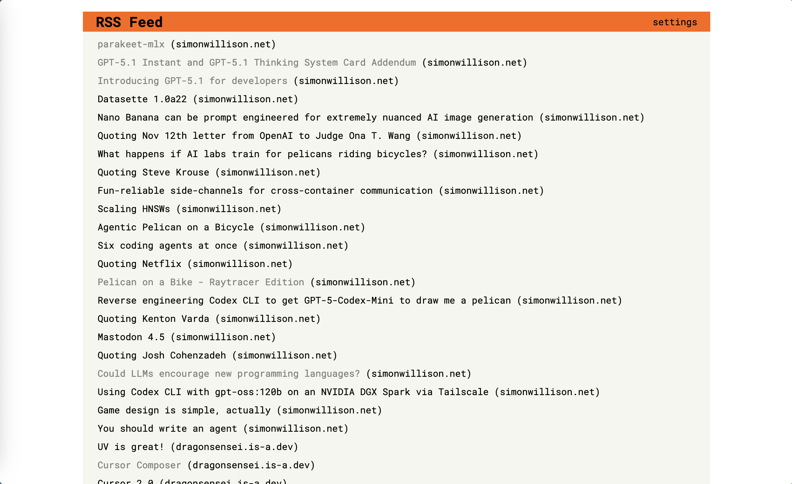

# Smart RSS

Smart RSS is a Hacker News themed RSS feed viewer for those of you who spend your time looking at HN.
For everyone else, this is a great fit too! You can add your own custom themes and customize it to your own needs.

## Features

Smart RSS includes
- RSS reader for blogs with RSS
- Custom Themes
- Saves your feeds into a JSON file
- Importing/Exporting of your feed data
- Individual addition and removal of RSS feeds

## Setup(macOS)

Make a virtual environment
```
python3 -m venv .venv
```

Activate virtual environment

Windows:
```
.venv\Scripts\activate
```

Linux/macOS:
```
source .venv/bin/activate
```

Instal dependencies:

This project uses `uv` so you need uv installed
```
uv sync
```

Start the development server

```
flask run --debug
```

## Screenshot

